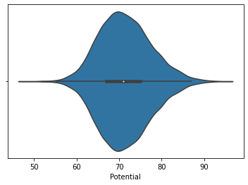

# РК1, ИУ5-64Б, Меркулова Н.А.

**Вариант 9** (задача 2, [датасет 4](https://www.kaggle.com/noriuk/us-education-datasets-unification-project))

Для заданного набора данных проведите обработку пропусков в данных для одного категориального и одного количественного признака. Какие способы обработки пропусков в данных для категориальных и количественных признаков Вы использовали? Какие признаки Вы будете использовать для дальнейшего построения моделей машинного обучения и почему?

## Выполнение


```python
import pandas as pd
import numpy as np
```

### Извлечение dataset


```python
data = pd.read_csv('./data.csv')
data
```

<div>
<table border="1" class="dataframe">
  <thead>
    <tr style="text-align: right;">
      <th></th>
      <th>Unnamed: 0</th>
      <th>ID</th>
      <th>Name</th>
      <th>Age</th>
      <th>Photo</th>
      <th>Nationality</th>
      <th>Flag</th>
      <th>Overall</th>
      <th>Potential</th>
      <th>Club</th>
      <th>...</th>
      <th>Composure</th>
      <th>Marking</th>
      <th>StandingTackle</th>
      <th>SlidingTackle</th>
      <th>GKDiving</th>
      <th>GKHandling</th>
      <th>GKKicking</th>
      <th>GKPositioning</th>
      <th>GKReflexes</th>
      <th>Release Clause</th>
    </tr>
  </thead>
  <tbody>
    <tr>
      <th>0</th>
      <td>0</td>
      <td>158023</td>
      <td>L. Messi</td>
      <td>31</td>
      <td>https://cdn.sofifa.org/players/4/19/158023.png</td>
      <td>Argentina</td>
      <td>https://cdn.sofifa.org/flags/52.png</td>
      <td>94</td>
      <td>94</td>
      <td>FC Barcelona</td>
      <td>...</td>
      <td>96.0</td>
      <td>33.0</td>
      <td>28.0</td>
      <td>26.0</td>
      <td>6.0</td>
      <td>11.0</td>
      <td>15.0</td>
      <td>14.0</td>
      <td>8.0</td>
      <td>€226.5M</td>
    </tr>
    <tr>
      <th>1</th>
      <td>1</td>
      <td>20801</td>
      <td>Cristiano Ronaldo</td>
      <td>33</td>
      <td>https://cdn.sofifa.org/players/4/19/20801.png</td>
      <td>Portugal</td>
      <td>https://cdn.sofifa.org/flags/38.png</td>
      <td>94</td>
      <td>94</td>
      <td>Juventus</td>
      <td>...</td>
      <td>95.0</td>
      <td>28.0</td>
      <td>31.0</td>
      <td>23.0</td>
      <td>7.0</td>
      <td>11.0</td>
      <td>15.0</td>
      <td>14.0</td>
      <td>11.0</td>
      <td>€127.1M</td>
    </tr>
    <tr>
      <th>2</th>
      <td>2</td>
      <td>190871</td>
      <td>Neymar Jr</td>
      <td>26</td>
      <td>https://cdn.sofifa.org/players/4/19/190871.png</td>
      <td>Brazil</td>
      <td>https://cdn.sofifa.org/flags/54.png</td>
      <td>92</td>
      <td>93</td>
      <td>Paris Saint-Germain</td>
      <td>...</td>
      <td>94.0</td>
      <td>27.0</td>
      <td>24.0</td>
      <td>33.0</td>
      <td>9.0</td>
      <td>9.0</td>
      <td>15.0</td>
      <td>15.0</td>
      <td>11.0</td>
      <td>€228.1M</td>
    </tr>
    <tr>
      <th>3</th>
      <td>3</td>
      <td>193080</td>
      <td>De Gea</td>
      <td>27</td>
      <td>https://cdn.sofifa.org/players/4/19/193080.png</td>
      <td>Spain</td>
      <td>https://cdn.sofifa.org/flags/45.png</td>
      <td>91</td>
      <td>93</td>
      <td>Manchester United</td>
      <td>...</td>
      <td>68.0</td>
      <td>15.0</td>
      <td>21.0</td>
      <td>13.0</td>
      <td>90.0</td>
      <td>85.0</td>
      <td>87.0</td>
      <td>88.0</td>
      <td>94.0</td>
      <td>€138.6M</td>
    </tr>
    <tr>
      <th>4</th>
      <td>4</td>
      <td>192985</td>
      <td>K. De Bruyne</td>
      <td>27</td>
      <td>https://cdn.sofifa.org/players/4/19/192985.png</td>
      <td>Belgium</td>
      <td>https://cdn.sofifa.org/flags/7.png</td>
      <td>91</td>
      <td>92</td>
      <td>Manchester City</td>
      <td>...</td>
      <td>88.0</td>
      <td>68.0</td>
      <td>58.0</td>
      <td>51.0</td>
      <td>15.0</td>
      <td>13.0</td>
      <td>5.0</td>
      <td>10.0</td>
      <td>13.0</td>
      <td>€196.4M</td>
    </tr>
    <tr>
      <th>...</th>
      <td>...</td>
      <td>...</td>
      <td>...</td>
      <td>...</td>
      <td>...</td>
      <td>...</td>
      <td>...</td>
      <td>...</td>
      <td>...</td>
      <td>...</td>
      <td>...</td>
      <td>...</td>
      <td>...</td>
      <td>...</td>
      <td>...</td>
      <td>...</td>
      <td>...</td>
      <td>...</td>
      <td>...</td>
      <td>...</td>
      <td>...</td>
    </tr>
    <tr>
      <th>18202</th>
      <td>18202</td>
      <td>238813</td>
      <td>J. Lundstram</td>
      <td>19</td>
      <td>https://cdn.sofifa.org/players/4/19/238813.png</td>
      <td>England</td>
      <td>https://cdn.sofifa.org/flags/14.png</td>
      <td>47</td>
      <td>65</td>
      <td>Crewe Alexandra</td>
      <td>...</td>
      <td>45.0</td>
      <td>40.0</td>
      <td>48.0</td>
      <td>47.0</td>
      <td>10.0</td>
      <td>13.0</td>
      <td>7.0</td>
      <td>8.0</td>
      <td>9.0</td>
      <td>€143K</td>
    </tr>
    <tr>
      <th>18203</th>
      <td>18203</td>
      <td>243165</td>
      <td>N. Christoffersson</td>
      <td>19</td>
      <td>https://cdn.sofifa.org/players/4/19/243165.png</td>
      <td>Sweden</td>
      <td>https://cdn.sofifa.org/flags/46.png</td>
      <td>47</td>
      <td>63</td>
      <td>Trelleborgs FF</td>
      <td>...</td>
      <td>42.0</td>
      <td>22.0</td>
      <td>15.0</td>
      <td>19.0</td>
      <td>10.0</td>
      <td>9.0</td>
      <td>9.0</td>
      <td>5.0</td>
      <td>12.0</td>
      <td>€113K</td>
    </tr>
    <tr>
      <th>18204</th>
      <td>18204</td>
      <td>241638</td>
      <td>B. Worman</td>
      <td>16</td>
      <td>https://cdn.sofifa.org/players/4/19/241638.png</td>
      <td>England</td>
      <td>https://cdn.sofifa.org/flags/14.png</td>
      <td>47</td>
      <td>67</td>
      <td>Cambridge United</td>
      <td>...</td>
      <td>41.0</td>
      <td>32.0</td>
      <td>13.0</td>
      <td>11.0</td>
      <td>6.0</td>
      <td>5.0</td>
      <td>10.0</td>
      <td>6.0</td>
      <td>13.0</td>
      <td>€165K</td>
    </tr>
    <tr>
      <th>18205</th>
      <td>18205</td>
      <td>246268</td>
      <td>D. Walker-Rice</td>
      <td>17</td>
      <td>https://cdn.sofifa.org/players/4/19/246268.png</td>
      <td>England</td>
      <td>https://cdn.sofifa.org/flags/14.png</td>
      <td>47</td>
      <td>66</td>
      <td>Tranmere Rovers</td>
      <td>...</td>
      <td>46.0</td>
      <td>20.0</td>
      <td>25.0</td>
      <td>27.0</td>
      <td>14.0</td>
      <td>6.0</td>
      <td>14.0</td>
      <td>8.0</td>
      <td>9.0</td>
      <td>€143K</td>
    </tr>
    <tr>
      <th>18206</th>
      <td>18206</td>
      <td>246269</td>
      <td>G. Nugent</td>
      <td>16</td>
      <td>https://cdn.sofifa.org/players/4/19/246269.png</td>
      <td>England</td>
      <td>https://cdn.sofifa.org/flags/14.png</td>
      <td>46</td>
      <td>66</td>
      <td>Tranmere Rovers</td>
      <td>...</td>
      <td>43.0</td>
      <td>40.0</td>
      <td>43.0</td>
      <td>50.0</td>
      <td>10.0</td>
      <td>15.0</td>
      <td>9.0</td>
      <td>12.0</td>
      <td>9.0</td>
      <td>€165K</td>
    </tr>
  </tbody>
</table>
<p>18207 rows × 89 columns</p>
</div>


### Обработка пропусков в данных

#### Проверим, есть ли пропущенные значения


```python
data.isnull().sum()
```


    Unnamed: 0           0
    ID                   0
    Name                 0
    Age                  0
    Photo                0
                      ... 
    GKHandling          48
    GKKicking           48
    GKPositioning       48
    GKReflexes          48
    Release Clause    1564
    Length: 89, dtype: int64


### 1. Замена пустых значений на среднее

Выполним замену для количественного признака GKReflexes. 


```python
1. Количество нулевых значений:
```


```python
data['GKReflexes'].isna().sum()
```


    48


2. Получим среднее:


```python
mean = data['GKReflexes'].mean()
mean
```


    16.710887163390055


3. Выполним замену и проверим количество пустых значений:


```python
data['GKReflexes'].fillna(mean, inplace=True)
data['GKReflexes'].isna().sum()
```


    0


### 2. Удаление пустых значений

Выполним удаление для категориального признака Club.

1. Количество нулевых значений:


```python
data['Club'].isna().sum()
```


    241


2. Удалим строки, содержащие нулевое значение колонки Club:


```python
data = data[~data['Club'].isna()]
data
```


<div>
<table border="1" class="dataframe">
  <thead>
    <tr style="text-align: right;">
      <th></th>
      <th>Unnamed: 0</th>
      <th>ID</th>
      <th>Name</th>
      <th>Age</th>
      <th>Photo</th>
      <th>Nationality</th>
      <th>Flag</th>
      <th>Overall</th>
      <th>Potential</th>
      <th>Club</th>
      <th>...</th>
      <th>Composure</th>
      <th>Marking</th>
      <th>StandingTackle</th>
      <th>SlidingTackle</th>
      <th>GKDiving</th>
      <th>GKHandling</th>
      <th>GKKicking</th>
      <th>GKPositioning</th>
      <th>GKReflexes</th>
      <th>Release Clause</th>
    </tr>
  </thead>
  <tbody>
    <tr>
      <th>0</th>
      <td>0</td>
      <td>158023</td>
      <td>L. Messi</td>
      <td>31</td>
      <td>https://cdn.sofifa.org/players/4/19/158023.png</td>
      <td>Argentina</td>
      <td>https://cdn.sofifa.org/flags/52.png</td>
      <td>94</td>
      <td>94</td>
      <td>FC Barcelona</td>
      <td>...</td>
      <td>96.0</td>
      <td>33.0</td>
      <td>28.0</td>
      <td>26.0</td>
      <td>6.0</td>
      <td>11.0</td>
      <td>15.0</td>
      <td>14.0</td>
      <td>8.0</td>
      <td>€226.5M</td>
    </tr>
    <tr>
      <th>1</th>
      <td>1</td>
      <td>20801</td>
      <td>Cristiano Ronaldo</td>
      <td>33</td>
      <td>https://cdn.sofifa.org/players/4/19/20801.png</td>
      <td>Portugal</td>
      <td>https://cdn.sofifa.org/flags/38.png</td>
      <td>94</td>
      <td>94</td>
      <td>Juventus</td>
      <td>...</td>
      <td>95.0</td>
      <td>28.0</td>
      <td>31.0</td>
      <td>23.0</td>
      <td>7.0</td>
      <td>11.0</td>
      <td>15.0</td>
      <td>14.0</td>
      <td>11.0</td>
      <td>€127.1M</td>
    </tr>
    <tr>
      <th>2</th>
      <td>2</td>
      <td>190871</td>
      <td>Neymar Jr</td>
      <td>26</td>
      <td>https://cdn.sofifa.org/players/4/19/190871.png</td>
      <td>Brazil</td>
      <td>https://cdn.sofifa.org/flags/54.png</td>
      <td>92</td>
      <td>93</td>
      <td>Paris Saint-Germain</td>
      <td>...</td>
      <td>94.0</td>
      <td>27.0</td>
      <td>24.0</td>
      <td>33.0</td>
      <td>9.0</td>
      <td>9.0</td>
      <td>15.0</td>
      <td>15.0</td>
      <td>11.0</td>
      <td>€228.1M</td>
    </tr>
    <tr>
      <th>3</th>
      <td>3</td>
      <td>193080</td>
      <td>De Gea</td>
      <td>27</td>
      <td>https://cdn.sofifa.org/players/4/19/193080.png</td>
      <td>Spain</td>
      <td>https://cdn.sofifa.org/flags/45.png</td>
      <td>91</td>
      <td>93</td>
      <td>Manchester United</td>
      <td>...</td>
      <td>68.0</td>
      <td>15.0</td>
      <td>21.0</td>
      <td>13.0</td>
      <td>90.0</td>
      <td>85.0</td>
      <td>87.0</td>
      <td>88.0</td>
      <td>94.0</td>
      <td>€138.6M</td>
    </tr>
    <tr>
      <th>4</th>
      <td>4</td>
      <td>192985</td>
      <td>K. De Bruyne</td>
      <td>27</td>
      <td>https://cdn.sofifa.org/players/4/19/192985.png</td>
      <td>Belgium</td>
      <td>https://cdn.sofifa.org/flags/7.png</td>
      <td>91</td>
      <td>92</td>
      <td>Manchester City</td>
      <td>...</td>
      <td>88.0</td>
      <td>68.0</td>
      <td>58.0</td>
      <td>51.0</td>
      <td>15.0</td>
      <td>13.0</td>
      <td>5.0</td>
      <td>10.0</td>
      <td>13.0</td>
      <td>€196.4M</td>
    </tr>
    <tr>
      <th>...</th>
      <td>...</td>
      <td>...</td>
      <td>...</td>
      <td>...</td>
      <td>...</td>
      <td>...</td>
      <td>...</td>
      <td>...</td>
      <td>...</td>
      <td>...</td>
      <td>...</td>
      <td>...</td>
      <td>...</td>
      <td>...</td>
      <td>...</td>
      <td>...</td>
      <td>...</td>
      <td>...</td>
      <td>...</td>
      <td>...</td>
      <td>...</td>
    </tr>
    <tr>
      <th>18202</th>
      <td>18202</td>
      <td>238813</td>
      <td>J. Lundstram</td>
      <td>19</td>
      <td>https://cdn.sofifa.org/players/4/19/238813.png</td>
      <td>England</td>
      <td>https://cdn.sofifa.org/flags/14.png</td>
      <td>47</td>
      <td>65</td>
      <td>Crewe Alexandra</td>
      <td>...</td>
      <td>45.0</td>
      <td>40.0</td>
      <td>48.0</td>
      <td>47.0</td>
      <td>10.0</td>
      <td>13.0</td>
      <td>7.0</td>
      <td>8.0</td>
      <td>9.0</td>
      <td>€143K</td>
    </tr>
    <tr>
      <th>18203</th>
      <td>18203</td>
      <td>243165</td>
      <td>N. Christoffersson</td>
      <td>19</td>
      <td>https://cdn.sofifa.org/players/4/19/243165.png</td>
      <td>Sweden</td>
      <td>https://cdn.sofifa.org/flags/46.png</td>
      <td>47</td>
      <td>63</td>
      <td>Trelleborgs FF</td>
      <td>...</td>
      <td>42.0</td>
      <td>22.0</td>
      <td>15.0</td>
      <td>19.0</td>
      <td>10.0</td>
      <td>9.0</td>
      <td>9.0</td>
      <td>5.0</td>
      <td>12.0</td>
      <td>€113K</td>
    </tr>
    <tr>
      <th>18204</th>
      <td>18204</td>
      <td>241638</td>
      <td>B. Worman</td>
      <td>16</td>
      <td>https://cdn.sofifa.org/players/4/19/241638.png</td>
      <td>England</td>
      <td>https://cdn.sofifa.org/flags/14.png</td>
      <td>47</td>
      <td>67</td>
      <td>Cambridge United</td>
      <td>...</td>
      <td>41.0</td>
      <td>32.0</td>
      <td>13.0</td>
      <td>11.0</td>
      <td>6.0</td>
      <td>5.0</td>
      <td>10.0</td>
      <td>6.0</td>
      <td>13.0</td>
      <td>€165K</td>
    </tr>
    <tr>
      <th>18205</th>
      <td>18205</td>
      <td>246268</td>
      <td>D. Walker-Rice</td>
      <td>17</td>
      <td>https://cdn.sofifa.org/players/4/19/246268.png</td>
      <td>England</td>
      <td>https://cdn.sofifa.org/flags/14.png</td>
      <td>47</td>
      <td>66</td>
      <td>Tranmere Rovers</td>
      <td>...</td>
      <td>46.0</td>
      <td>20.0</td>
      <td>25.0</td>
      <td>27.0</td>
      <td>14.0</td>
      <td>6.0</td>
      <td>14.0</td>
      <td>8.0</td>
      <td>9.0</td>
      <td>€143K</td>
    </tr>
    <tr>
      <th>18206</th>
      <td>18206</td>
      <td>246269</td>
      <td>G. Nugent</td>
      <td>16</td>
      <td>https://cdn.sofifa.org/players/4/19/246269.png</td>
      <td>England</td>
      <td>https://cdn.sofifa.org/flags/14.png</td>
      <td>46</td>
      <td>66</td>
      <td>Tranmere Rovers</td>
      <td>...</td>
      <td>43.0</td>
      <td>40.0</td>
      <td>43.0</td>
      <td>50.0</td>
      <td>10.0</td>
      <td>15.0</td>
      <td>9.0</td>
      <td>12.0</td>
      <td>9.0</td>
      <td>€165K</td>
    </tr>
  </tbody>
</table>
<p>17966 rows × 89 columns</p>
</div>


Как можно видеть, количество строк датасета уменьшилось.

3. Проверим количество пустых значений поля Club:


```python
data['Club'].isna().sum()
```


    0


### Дополнительное задание

Построим график "Скрипичная диаграмма" (Violin plot) для поля Potential


```python
import seaborn as sns
sns.violinplot(x=data['Potential'])
```


    <matplotlib.axes._subplots.AxesSubplot at 0x11517edd8>




